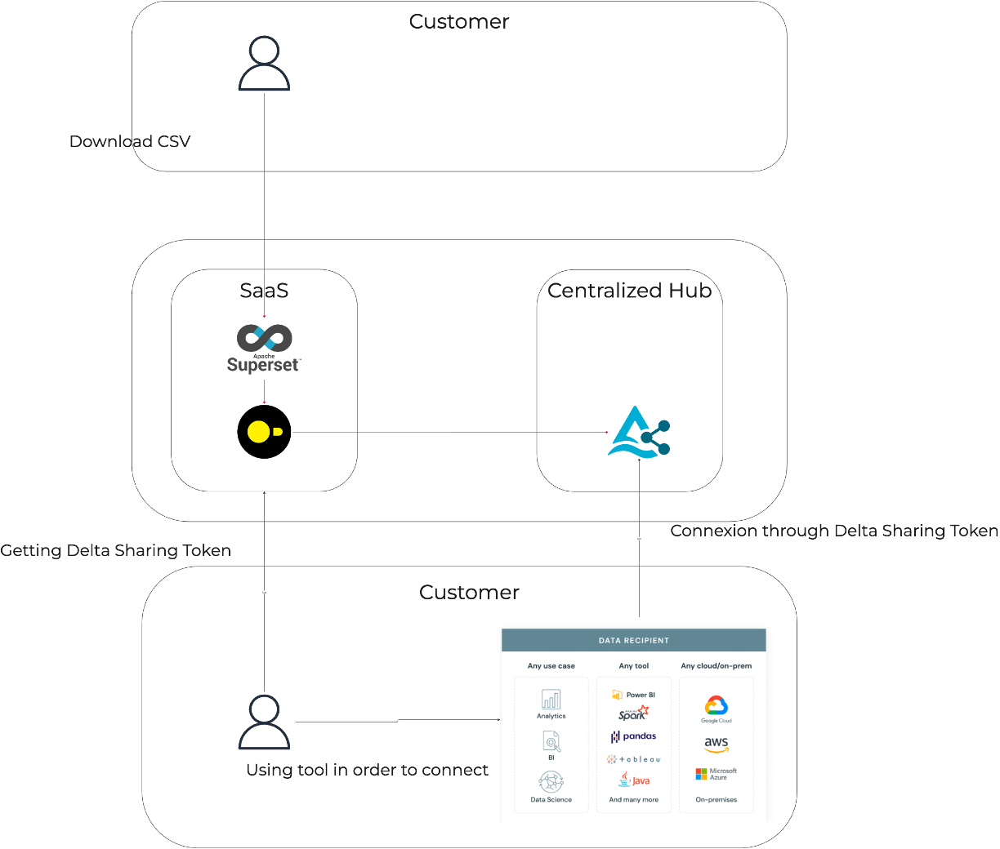
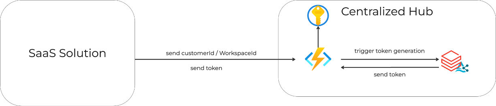

# Delta Sharing feature infrastructure & middleware for Empowering Users with Platform Usage Analytics

Flow overview:



Status:

| Service              | Status
| :---------------- | :---------------- |
| Delta Sharing Middleware              | Ok | 
| Apache Superset             | In progress | 
| DuckDB             | In progress | 


## Infrastructure

This repository contains the infrastructure & the deployment code for the Delta Sharing feature application using Terraform. It sets up the necessary resources and configurations to run Delta Sharing feature efficiently.

`secrets.tfvars` has to be filled with the following variables:
| Name              | Description | Sample Value |
| :---------------- | :---------------- | :---------------- |
| databricks_token        | Databricks' access token. Will be store in Azure Key Vault. |   `[ { name         = "databricksToken", secret_value = <<EOF { "CLIENT_ID": "89dbYu78-XXX-XXX-XXX-XXXX", "CLIENT_SECRET" : "doseXXXXXXXXXXXXXXXXX" } EOF }]`   |
| databricks_tables_names           | Unity Catalog's table name. Will be store in Azure Key Vault. |   `[ { name         = "databricksTablesNames", secret_value =  <<EOF { "platform_aggregated_usage": "<catalog_name>.<database_name>.<table_name>" }  EOF } ]`   |
| databricks_token_name    | Azure Key Vault's Databricks token name. Will be store on environnment variable.  | "databricksToken"   |
| databricks_delta_sharing_name    | Azure Key Vault's Unity Catalog table name.. Will be store on environnment variable. |  "databricksTablesNames"   |
| databricks_host | Databricks' host. Will be store on environnment variable.  |  "{xxx}.azuredatabricks.net"   |

Architecture overview:



### Terraform Commands

#### Format Code

Before deploying, ensure that your Terraform code is properly formatted by running the following command:

```bash
terraform fmt -recursive -- .
```

#### Deployment Commands

To execute Terraform, you will need to run the following commands based on your environment (development or production):

##### For Development

1- Setup azure account build environment

```bash
az account set --subscription "530b25b4-f29b-4fb5-98c9-a43e38c17466"
```

2- Initialize Terraform with Development Configuration:

```bash
terraform init -backend-config=environment/backend.dev.conf -reconfigure
```

- This command initializes the Terraform working directory with the backend configuration specified for the development environment. The `-reconfigure` flag is used to reconfigure the backend with any changes made.

3- Apply the Terraform Configuration:

```bash
terraform apply -var-file=environment/dev.tfvars -var-file=environment/dev.secrets.tfvars
```
- This command applies the changes required to reach the desired state of the infrastructure defined in the Terraform configuration files. It uses the variables specified in `dev.secrets.tfvars` for sensitive data and environment-specific settings.

##### For Production

1- Setup azure account build environment

```bash
az account set --subscription "XXXXXX"
```

2- Initialize Terraform with Production Configuration:

```bash
terraform init -backend-config=environment/backend.run.conf -reconfigure
```
- Similar to the development initialization, this command sets up the Terraform working directory for the production environment using the specified backend configuration.

3- Apply the Terraform Configuration:

```bash
terraform apply -var-file=environment/run.tfvars -var-file=environment/run.secrets.tfvars
```

- This command applies the changes to the production environment, utilizing the variable file `prd.secrets.tfvars` for configuration specifics.

## Application

### For Local Mode

You can launch a local environment on `local` folder. In order to do it, follow the following steps:

1- Install the required dependencies using pip

```python
pip install -r requirements.txt
```

2- Configure .env file

Create a .env file on `local` folder root & fill the following variables:

```
KEY_VAULT_NAME="{xxx}"
DATABRICKS_TOKEN_NAME="databricksToken"
DELTASHARING_TABLES_NAME="databricksTablesNames"
DATABRICKS_HOST="{xxx}.azuredatabricks.net"
```

3 - Launch unicorn

```python
uvicorn main:app --reload
```

### For Development or Production

1 - Deploy App on Azure Function

On VS code, Azure Functions: Deploy to Function App.